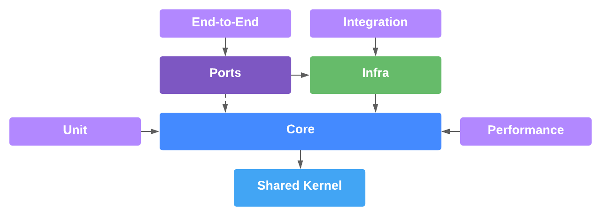
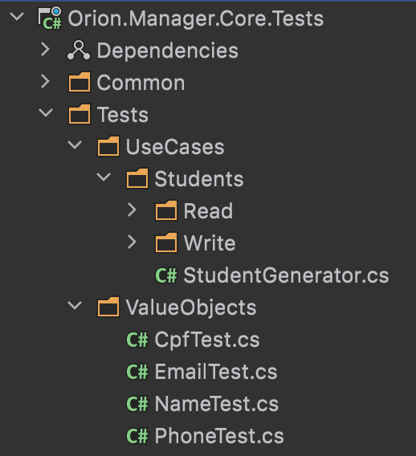

# Orion

## 1. Architecture

For the **Manager** app architecture I'm using a **Clean Architecture** model, splitting the solution into: **Core**, **Infra**, **Service (Ports)** and **Shared Kernel** layers.

 
 

### Core
The **Core** layer is responsible for the **Domain Entities**, **Value Objects**, **Domain Services**, **Domain Events** and **Use Cases**.

The organization is based upon **Screaming Architecture** concept by Uncle Bob that purposes that you application architecture should scream what the system do. So I've prefer a organization by context rather than by component type.

Other principle that I've followed was **CQRS/CQS**, so the **Use Cases** are divided into **Write** or **Read** operations. Also any **Use Cases** has his owns **Command**, **Query**, **Result** and **Handler**, this last only for **orchestration concerns**.
 

The main focus is to keep the Domain isolated from external details.

### Infra
The Infra Project is responsible for **Repository Concerns** (**Mappings**, **Migrations**, **Repository Implementations**, **Database Contexts** and **Unit of Work**), **Dependency Injection** and **External Providers** for integration or services consumption.

### Services
This are projects that consumes the **Core Use Cases**. Can be **APIs**, **gRPC Services**, **Serverless Functions**, **Console Applications** or **MVCs**. As the domain does not depends upon, the consumption can be anything.

### Shared Kernel
This are common resources that needs to be used between application layers, like **Application Settings**. This project is use to avoid circular dependencies between the other projects.

## 2. Dependencies Structure

## 3. Tests Structure

## 4. Serverless
The **Messenger** app was created to be an **Microservice** to send SMS, E-mail, and Push Notifications. The project is an **Azure Function**, triggered by an **RabbitMQ** queue/topic or a **gRPC** call.

## 5. Tests 
The Manager tests are focused on Domain. There are **Unit Tests** on **Entities** and **Value Objects** and **Integration Tests** on **Use Cases**. Note that are no network calls need on this tests, they are integration based on concept there they are testing the Use Case. 

The folder structure are similar to the structured used on Core.

## 6. Packages
There is some packages at SharedKernel to provide common solutions that can be packaged using nuget and installed at projects.

- Asp.net - For **Endpoints** pattern implementation
- Core - For **Domain Events**, **Value Object** and **Aggregate** patterns
- Data Contracts - For some common **Command**, **Query** and **Results**
- Domain Validation - To use **Domain Validation** instead of throwing exception for non exceptional cases
- OperationResult - To implement **Railway Oriented Programing** into methods using signature honesty
- Repository - To implement **Specification**, **Unit of Work** and other repositories concepts
- Resilience - To HTTP calls and other resources that may need practices like **Retrying**, **Circuit Breaker** and **Timeout** policies